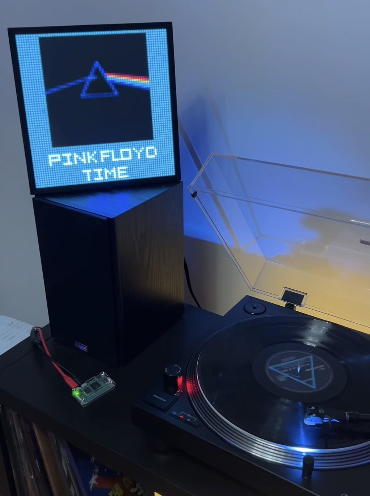

# VinylPi64
<p align="center">

  <!-- Hardware & Platform -->
  
  
  <!-- Software -->
  

  <!-- License -->
  
  
</p>

VinylPi is a Raspberry Pi project that listens to audio from a turntable, identifies the currently playing song using **ShazamIO**, fetches album metadata and artwork, generates a **64×64 pixel frame**, and displays it on a **Divoom Pixoo**.

<p align="left">
  
</p>

**Important: Hardware-specific implementation**

I built this project specifically for my own hardware setup:

- [Raspberry Pi Zero 2 W](https://www.raspberrypi.com/products/raspberry-pi-zero-2-w/)  
- [Audio-Technica AT-LP120XUSB](https://www.audio-technica.com/en-us/at-lp120xusb)
- [Divoom Pixoo-64](https://divoom.com/products/pixoo-64)

If you use different hardware, you will most likely have to modify parts of the code, like:
- **turntable without USB**: you will need a soundcard or USB microphone on your pi
- **other pixel display**: you need to modify the Divoom API calls

## Features

- Auto-detects USB audio device  
- USB audio capture from turntable  
- Automatic music recognition using **ShazamIO**  
- Album cover retrieval  
- Custom **64×64 pixel renderer**  
  - centered album cover 
  - custom pixel font 
  - dynamic/manual background and text font
  - marquee text for long titles/bands
  - fallback image
- Send results to pixel diplay
---

## Example Output

<p align="left">
  
</p>

<p align="left">
  
</p>

## Installation


### 0. Install OS on the Raspberry Pi

- I recommend using **Raspberry Pi OS Lite (64-bit)** for best performance (again I am using the Raspberry PI zero 2 w). 
- Flash it using the official [**Raspberry Pi Imager**](https://www.raspberrypi.com/software/).
- Enable SSH during flashing.  
- Boot the Pi and connect via SSH:

```bash
ssh user@hostname
```
### 1. Clone the repository
```bash
git clone https://github.com/simontrost/VinylPi64.git
cd VinylPi64
```
hint: you might need to `sudo apt install git` first

### 2. Create and activate a virtual environment
```bash
python3 -m venv venv
source venv/bin/activate
```
hint: you might need to `sudo apt install -y python3-venv python3-dev`first

### 3. Install dependencies
```bash
pip install -r requirements.txt
```
hint: you might need to `pip install --upgrade pip` first
### 4. Check for your audio device:
```
arecord -l
```
eg:  `0 USB AUDIO CODEC: Audio (hw:0,0), ALSA (2 in, 2 out)`
hint: you might also want to get ffmpeg `sudo apt install ffmpeg`

### 5. Configuration:
```bash
nano config.json
```
Configure:
- the Pixoo IP (or enable subnet discovery)
- the audio device name
- fallback image path
- preview paths
- debug logs, etc

### 6. Execute
with active env:
```bash
python3 main.py
```

## Autostart on boot

### 1. Create service file:
create a file: 
```bash
sudo nano /etc/systemd/system/vinylpi.service
```
with the following content and adjust the username and paths

```bash
[Unit]
Description=VinylPi64 – autostart on boot
After=network-online.target sound.target
Wants=network-online.target

[Service]
Type=simple
User=username
WorkingDirectory=/home/user/VinylPi64
ExecStart=/home/user/VinylPi64/venv/bin/python -u /home/user/VinylPi64/main.py
Restart=on-failure
RestartSec=5

[Install]
WantedBy=multi-user.target
```

Save and exit

### 2. Activate
```bash
sudo systemctl daemon-reload
sudo systemctl enable vinylpi.service
sudo systemctl start vinylpi.service
```
hint: check with `sudo systemctl status vinylpi.service` (should be "active (running)")

### 3. Logs
if something is not working check
```bash
journalctl -u vinylpi.service -f
```
## License
Creative Commons Attribution–NonCommercial 4.0

Full license text:
https://creativecommons.org/licenses/by-nc/4.0/legalcode.txt