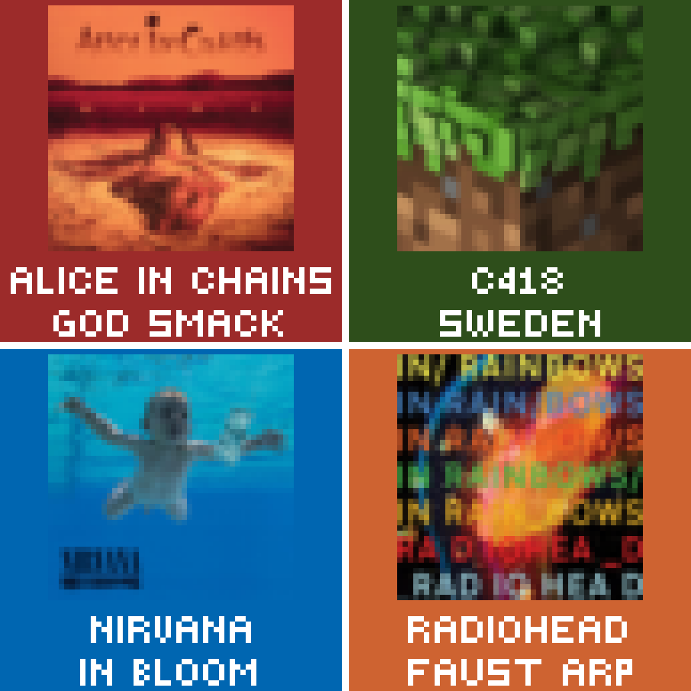
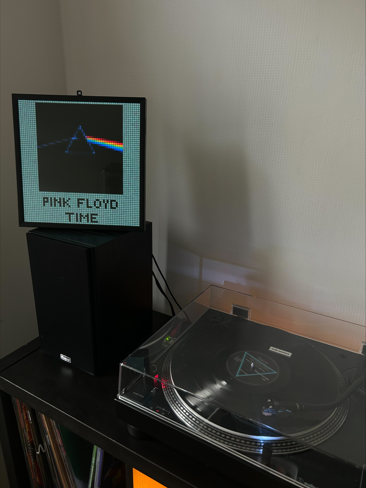
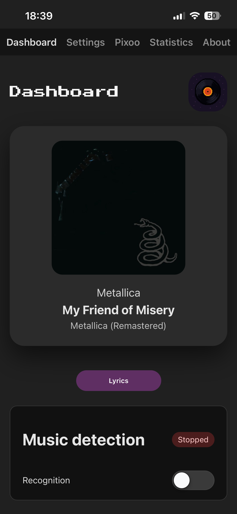
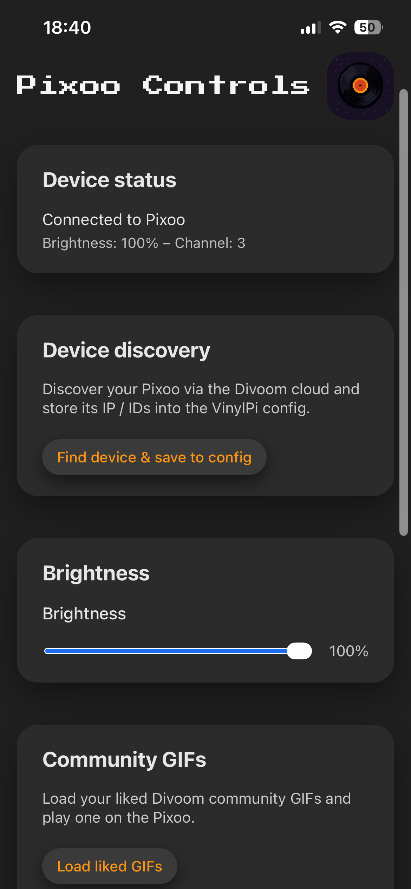
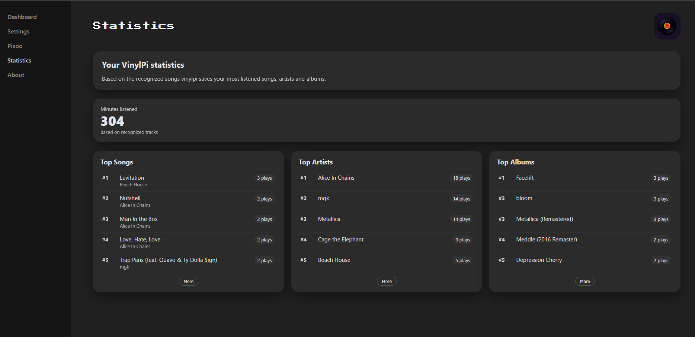
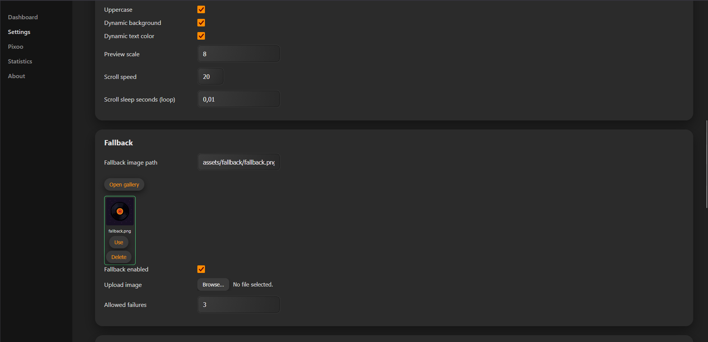

# VinylPi64
<p align="center">

  <!-- Hardware & Platform -->
  
  
  <!-- Software -->
  

  <!-- License -->
  
  
</p>

VinylPi is a Raspberry Pi project that listens to audio from a turntable, identifies the currently playing song using **ShazamIO**, fetches album metadata and artwork, generates a **64×64 pixel frame**, and displays it on a **Divoom Pixoo**. It also features a webapp with a dashboard and settings.

<p align="left">
  
</p>

**Important: Hardware-specific implementation**

I built this project specifically for my own hardware setup:

- [Raspberry Pi Zero 2 W](https://www.raspberrypi.com/products/raspberry-pi-zero-2-w/)  
- [Audio-Technica AT-LP120XUSB](https://www.audio-technica.com/en-us/at-lp120xusb)
- [Divoom Pixoo-64](https://divoom.com/products/pixoo-64)

If you use different hardware, you will most likely have to modify parts of the code, like:
- **turntable without USB**: you will need a soundcard or USB microphone on your pi
- **other pixel display**: you need to modify the Divoom API calls

## Features

- Auto-detects USB audio device  
- USB audio capture from turntable  
- Automatic music recognition using **ShazamIO**  
- Album cover retrieval  
- Custom **64×64 pixel renderer**  
  - centered album cover 
  - custom pixel font 
  - dynamic/manual background and text font
  - marquee text for long titles/bands
  - fallback image
- Send results to pixel diplay
- local WebApp:
  - dashboard with current song, lyrics and switch (on/off)
  - settings: configure vinylpi
  - pixoo: configure your divoom pixoo
  - statistics: keeps track of your listened minutes, songs, artists and albums
  - about: support me :)  
- Home Assistant Integration
---

## Example Output

### Preview

<p align="left">
  
</p>

### Setup

<p align="left">
  
</p>

### WebApp Mobile

|  |  |

### WebApp Desktop

|  |  |


## Installation


### 0. Install OS on the Raspberry Pi

- I recommend using **Raspberry Pi OS Lite (64-bit)** for best performance (again I am using the Raspberry Pi zero 2 w). 
- Flash it using the official [**Raspberry Pi Imager**](https://www.raspberrypi.com/software/).
- Enable SSH during flashing.  
- Boot the Pi and connect via SSH:

```bash
ssh user@hostname
```
### 1. Clone the repository
```bash
git clone https://github.com/simontrost/VinylPi64.git
cd VinylPi64
```
hint: you might need to `sudo apt install git` first

### 2. Create and activate a virtual environment
```bash
python3 -m venv venv
source venv/bin/activate
```
hint: you might need to `sudo apt install -y python3-venv python3-dev` first

### 3. Install dependencies
```bash
pip install -r requirements.txt
```
hint: you might need to `pip install --upgrade pip` first
### 4. Check for your audio device:
```
arecord -l
```
eg:  `0 USB AUDIO CODEC: Audio (hw:0,0), ALSA (2 in, 2 out)`  
hint: you might also want to get ffmpeg `sudo apt install ffmpeg`

### 5. Configuration:
If you don't want to use the web interface, you will have to edit the config manually
```bash
nano config.json
```

### 6. Execute
with active env:
```bash
python vinylpi/dashboard.py
```
hint: you can start the actual music detection from the webapp: `http://vinylpi.local:8080/`or via `python -m vinylpi.main`

## Autostart on boot

### 1. Create service file:
create a file: 
```bash
sudo nano /etc/systemd/system/vinylpi.service
```
with the following content and adjust the username and paths

```bash
[Unit]
Description=VinylPi Dashboard
After=network-online.target
Wants=network-online.target

[Service]
User=pi
WorkingDirectory=/home/pi/VinylPi64
#EnvironmentFile=/home/pi/vinylpi.env
#ExecStart=/home/pi/VinylPi64/venv/bin/gunicorn --bind 0.0.0.0:5000 vinylpi.dashboard:app
ExecStart=/home/pi/VinylPi64/venv/bin/python3 -m vinylpi.web.dashboard
Restart=on-failure

[Install]
WantedBy=multi-user.target
```

Save and exit. You can decide if you really nead a gunicorn server, for my purpose it's not really needed.  
If you do want to use gunicorn, make sure you install it via `pip install gunicorn`.  
If you want to use the home assistant integration, you will need to set your API token in `vinylpi.env`.

### 2. Activate
```bash
sudo systemctl daemon-reload
sudo systemctl enable vinylpi.service
sudo systemctl start vinylpi.service
```
hint: check with `sudo systemctl status vinylpi.service` (should be "active (running)")

### 3. Logs
if something is not working check
```bash
journalctl -u vinylpi.service -f
```

## Home Assistant Integration
I made a simple Home Assistant integration, that let's you switch the pixoo itself and the music detection off and on. It also features color sync mode.
You can enable/disable HA integration it in the config. If turned on and correctrly configured, everytime a new song gets detected, the smart lights in your home change color according to the album cover.

### 1. VinylPi Configuration
In the config, set `"use_ha": true` and configure the IP of your HA. 

### 2. Home Assistant configuration
In the `configuration.yaml` of your HA you will need something like this:
```sh
# Loads default set of integrations. Do not remove.
default_config:

# Load frontend themes from the themes folder
frontend:
  themes: !include_dir_merge_named themes

automation: !include automations.yaml
script: !include scripts.yaml
scene: !include scenes.yaml

sensor:
  - platform: rest
    name: VinylPi Pixoo Liked Gifs
    resource: "http://vinylpi.local:8080/api/pixoo/liked-gifs"
    method: GET
    headers:
      X-Api-Token: !secret vinylpi_api_token
    value_template: "{{ value_json.ok }}"
    json_attributes:
      - gifs
    scan_interval: 3600


rest_command:
  vinylpi_pixoo_play_remote:
    url: "http://vinylpi.local:8080/api/pixoo/play-remote"
    method: POST
    headers:
      Content-Type: application/json
      X-Api-Token: !secret vinylpi_api_token
    payload: >
      {"file_id":"{{ file_id }}"}

  vinylpi_music_mode_on:
    url: "http://vinylpi.local:8080/api/ha/music_mode/on"
    method: POST
    headers:
      X-Api-Token: !secret vinylpi_api_token

  vinylpi_music_mode_off:
    url: "http://vinylpi.local:8080/api/ha/music_mode/off"
    method: POST
    headers:
      X-Api-Token: !secret vinylpi_api_token

  vinylpi_pixoo_off:
    url: "http://vinylpi.local:8080/api/ha/off"
    method: POST
    headers:
      X-Api-Token: !secret vinylpi_api_token

  vinylpi_pixoo_on:
    url: "http://vinylpi.local:8080/api/ha/on"
    method: POST
    headers:
      X-Api-Token: !secret vinylpi_api_token
```
### 3. API Token
It's just a hobby project (local) so if you don't care, comment it out. Otherwise:

In the `secrets.yaml` of you HA, set:
```yaml
vinylpi_api_token: "your_api_token"
```
and in your vinylpi.env set:
```sh
VINYLPI_API_TOKEN=your_api_token
```

### 4. Home Assistant Script
This part really depends on what lights you have available in your HA Setup. If you have Lamps that can take RGB values as input, it could look like this:

automation:
```yaml
alias: Vinylpi Sync
description: ""
triggers:
  - trigger: webhook
    allowed_methods:
      - POST
      - PUT
    local_only: true
    webhook_id: vinylpi_cover_color
conditions:
  - condition: state
    entity_id: input_boolean.vinylpi_color_sync
    state:
      - "on"
actions:
  - action: script.vinylpi_color_setter
    data:
      r: "{{ trigger.json.r }}"
      g: "{{ trigger.json.g }}"
      b: "{{ trigger.json.b }}"
mode: single
```

and script:
```yaml
alias: VinylPi Color Setter
mode: queued
fields:
  r:
    description: Red 0-255
    example: 120
  g:
    description: Green 0-255
    example: 20
  b:
    description: Blue 0-255
    example: 200
sequence:
  - action: light.turn_on
    target:
      entity_id:
        - light.lamp1
        - light.lamp2
        - light.lamp3
    data:
      rgb_color:
        - "{{ r | int }}"
        - "{{ g | int }}"
        - "{{ b | int }}"
description: ""
```

## License
Creative Commons Attribution–NonCommercial 4.0

Full license text:
https://creativecommons.org/licenses/by-nc/4.0/legalcode.txt